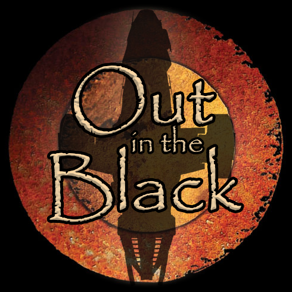
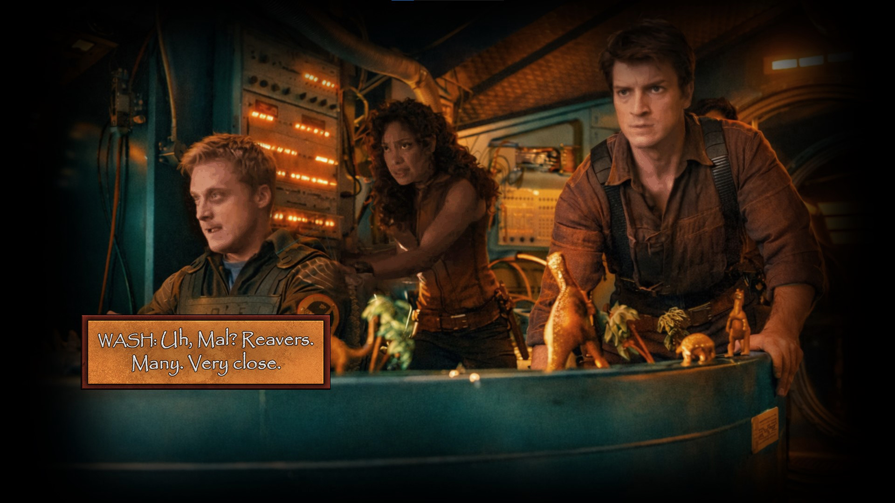
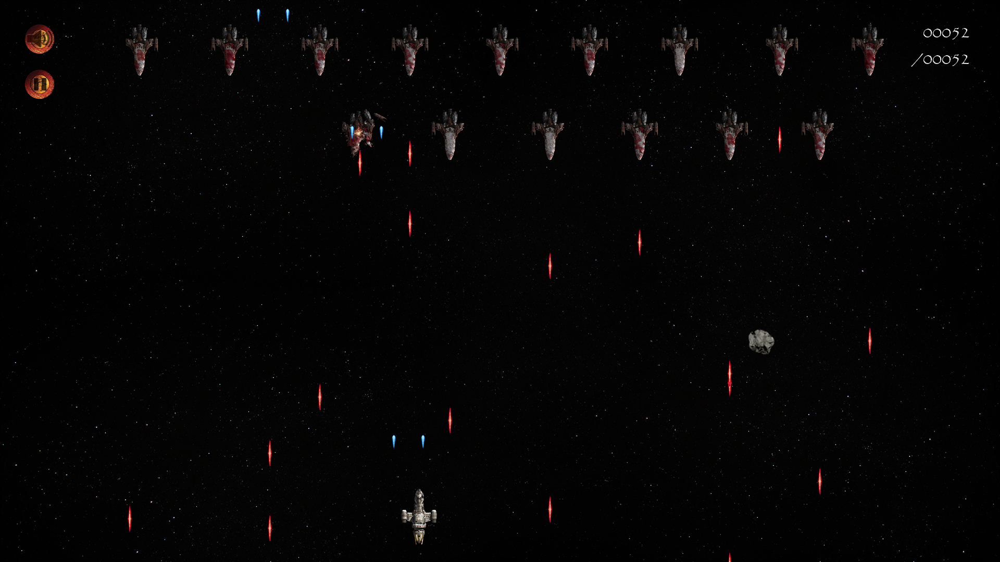
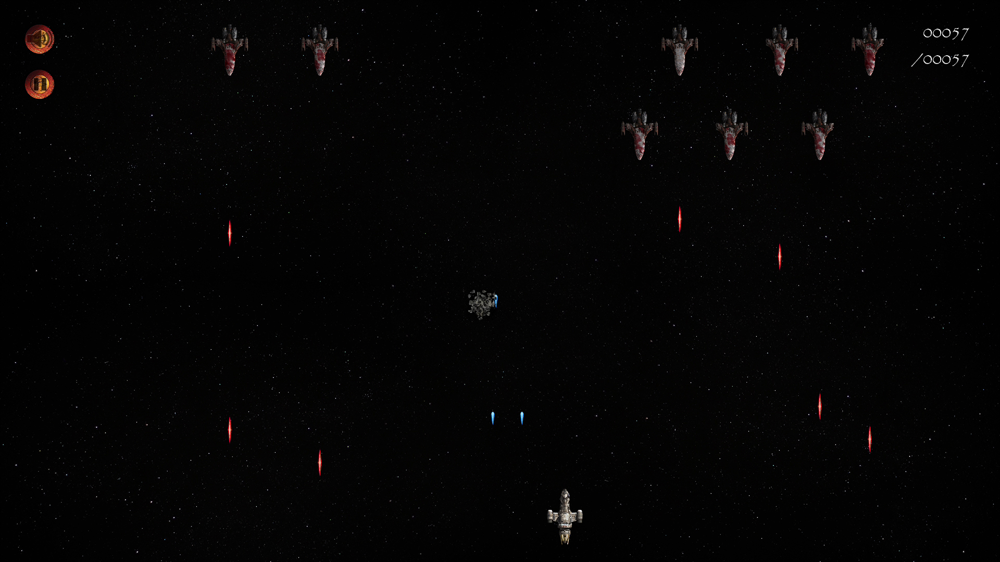
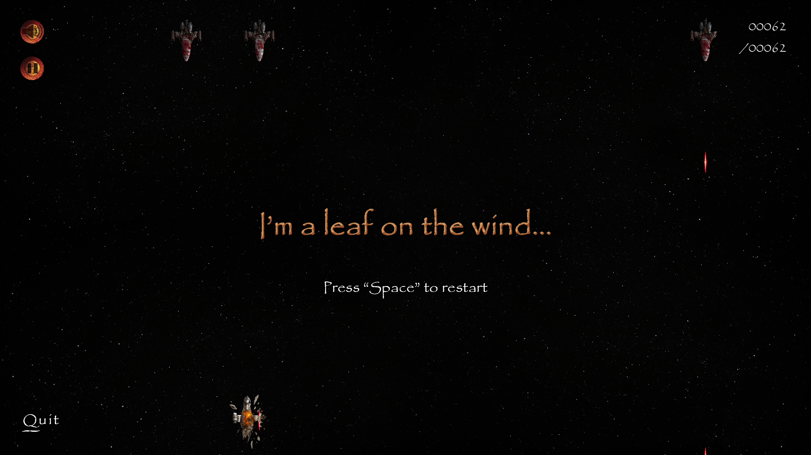

<p align="center">
  
</p>
<br>

# Firefly: Out in the Black
[Download Windows Build](https://github.com/ThanosTzinieris/firefly-out-in-the-black/releases/latest)

A 2D arcade-style space shooter built with Python and Pygame, inspired by classic space combat games and the Firefly universe.

Take control of Serenity and survive waves of Reaver ships, unpredictable meteor trajectories, and escalating combat scenarios, all rendered through a dynamic, resolution-independent engine.

---

## Overview

**Firefly: Out in the Black** is a modular, event-driven game built from the ground up using Python and Pygame.

The project focuses on clean architecture, real-time gameplay systems, and scalable rendering, while delivering a fast-paced arcade experience.

Players pilot Serenity (now mounted with a pair of Series 3 plasma guns) against increasingly difficult enemy formations, avoiding hazards and maximizing score through precision and timing.

---

## Key Features

### Core Systems
- Event-driven game loop with centralized input handling
- State machine architecture (Intro → Playing → Paused → Game Over)
- Modular object-oriented design for all entities

### Gameplay Mechanics
- Smooth player movement with responsive controls
- Dual plasma cannon firing system
- Enemy AI with randomized attack behavior
- Dynamic level progression with formation-based spawning

### Combat & Physics
- Pixel-perfect collision detection using masks
- Projectile systems (plasma blasts & harpoons)
- Curved meteor trajectories using arc-based motion
- Impact system with timed transitions and visual feedback

### Rendering & Scaling
- Logical resolution system (1920x1080 internal)
- Dynamic viewport scaling for any screen size and shape
- Fullscreen toggle with aspect ratio preservation
- Resolution-independent positioning and movement

### Cinematics & UI
- Timed intro sequence with transitions and overlays
- Image-based UI buttons (music, pause, quit)
- In-game controls overlay during entry sequence
- Game over screen with visual feedback

### Audio System
- Multi-phase music system:
  - Intro music
  - Gameplay loop
  - Game over track
- Seamless asynchronous music transitions
- Toggleable sound via UI or keyboard

### Scoring System
- Real-time score tracking
- Persistent high score saved to file
- Dynamic scoreboard rendering

---

## Controls

| Key | Action |
|-----|--------|
| **A / Left Arrow** | Move left |
| **D / Right Arrow** | Move right |
| **Space** | Fire / Skip intro / Restart |
| **P / Esc** | Pause / Resume |
| **M** | Toggle music |
| **F** | Toggle fullscreen |
| **Q** | Quit (in pause/game over) |

---

## How to Run

Make sure you have Python installed.

Install dependencies:

```
pip install pygame
```

Run the game:

```
python Game.py
```

---

## Project Structure

```
.
├── Game.py
├── Game_Settings.py
├── Game_Functions.py
├── Game_Objects.py
├── Ship.py
├── Reavers.py
├── Meteors.py
├── Blasts.py
├── Buttons.py
├── Scoreboard.py
├── Intro_Sequence.py
│
├── Assets/
│   ├── Ships/
│   ├── Meteors/
│   ├── Buttons/
│   ├── Surfaces/
│   ├── Cinematics/
│   ├── Soundscapes/
│   └── Fonts/
│
├── Scores/
│   └── high_score.txt
│
├── Screenshots/        # README visuals (logo, gameplay images)
│   ├── logo.png
│   ├── intro.jpg
│   ├── gameplay.jpg
│   ├── meteor.jpg
│   └── gameover.jpg
```

---

## Screenshots

### Cinematic Intro


### Combat




### Game Over


---

## Technical Highlights

- Custom base class system for all game objects
- Viewport-based rendering pipeline
- Decoupled rendering and logic layers
- Safe list mutation patterns during iteration
- Path-based asset management using `pathlib`
- Clean separation of game states and transitions

---

## Technologies Used

- Python
- Pygame

---

## Notes

This project was built as part of my ongoing journey into software development, with a strong focus on:
- clean architecture
- modular design
- real-time systems
- scalability

---

## Future Improvements

- Difficulty scaling system (arsenal progression, enemy motion, meteor storms)
- Sound effects expansion
- Settings menu

---

## Acknowledgements

Inspired by the Firefly universe and classic arcade shooters.
Ship designs based on the work of legendary designer Sean Kennedy.

---

## Closing Note

This project represents a significant step forward in my development journey, combining gameplay design with structured, scalable code.

If you enjoyed it, feel free to explore, fork, or reach out!
